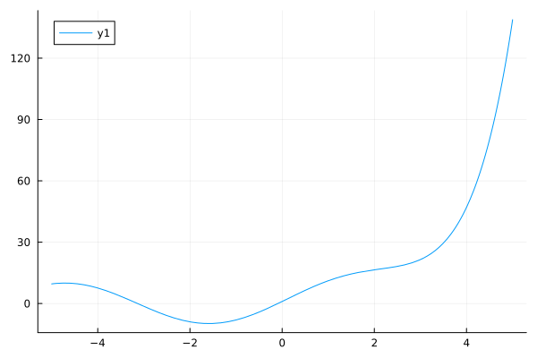

# Table of Contents

1.  [Preamble](#org664c9cb)
2.  [Regression Approach](#orgcfbe2a9)
3.  [PDE System](#org28a28d3)
    1.  [Optimization Problem](#orge7d8277)
4.  [Linear Sytem](#orgabf3de9)

# Preamble

    module PDESystem
    
    end

    test()

    hello world

    
    using Plots
    f(x) = exp(x) + 10 * sin(x)
    plot(f)
    savefig("images/plot.png")

    using KernelAbstractions
    
    @kernel function Δ_kernel(A , Δ)
        I = @index(Global , Cartesian)
        Ix = oneunit(I)
        Δ[I] = 0
        dimensions = ndims(A)
        for i in 1:dimensions
            zero(I)
            In = CartesianIndex()
            Δ[I] += A[I + In] - A[I]
        end
    end

    Δ_kernel (generic function with 4 methods)

    dt = 0.1
    for t in 0:0.1:10
    x += dx * dt
    end

# Regression Approach

given $ \hat{X}:=\left\{ x_j \right\}_{j=1}^n \subset\RR ^d$ we aim

\begin{align}
\label{eq:approx}
u_h(x) &= \sum_{j=1}^{n} a_j k(x_j,x)
\end{align}

correspondingly we are able to directly compute

\begin{align*}
\nabla_x u(x) &= \sum_{j=1}^n a_j \nabla_x  k(x_j ,x) \\
- \nabla_x \cdot \left( a(x) \nabla_x u(x) \right) &= - \left< \nabla_x a(x) , \nabla_x u(x) \right> - a(x) \Delta_x u(x) \\
&=  - \sum_{j=1}^{n} a_j \left( \left< \nabla_x a(x) , \nabla_x k(x_j,x)  \right> - a(x) \Delta_x k(x_j,x)\right)
\end{align*}

where $\nabla_x , \Delta_x$ are the partial gradients and laplacians with respect to the second argument of $k(x_j, \cdot )$.
for a radial basis function $\phi (r) \in  C^2(\RR)$  and a corresponding RBF kernel $k(x,x') := \phi (\|x-x'\|)$ they can be computed trivially

\begin{align}
\label{eq:2}
\nabla_x k(x',x) &= \phi'(\|x-x'\|)x\\
\Delta_x k(x',x) &= \phi''(\|x-x'\|) + \phi'(\|x-x'\|) \left< x,x \right>\\
\end{align}

Aim of the regression is then, to minimize

\begin{align}
\label{eq:3}
\mathcal{J}(\vec{a} ; \hat{X})
\end{align}

# PDE System

such that they satisfy the following system

\begin{align}
\label{eq:pde}
- \nabla  \left( a(x) \nabla u(x) \right) &= f(x) & \text{in} \quad \Omega \\
u(x) &= g_D(x) & \text{on} \quad  \Gamma_D \\
\left( a(x) \nabla u(x)  \right) \cdot  \vec{n}(x) &= g_N & \text{on} \quad \Gamma_N
\end{align}

## Optimization Problem

If the solution to the PDE system \eqref{eq:pde} exists, then finding the solution is equivalent to minimizing the following functional:

\begin{align}
\label{eq:4}
\mathcal{J}(u) &= \int_{\Omega}
\end{align}

# Linear Sytem

    using KernelAbstractions
    @kernel function assemble_matrix

